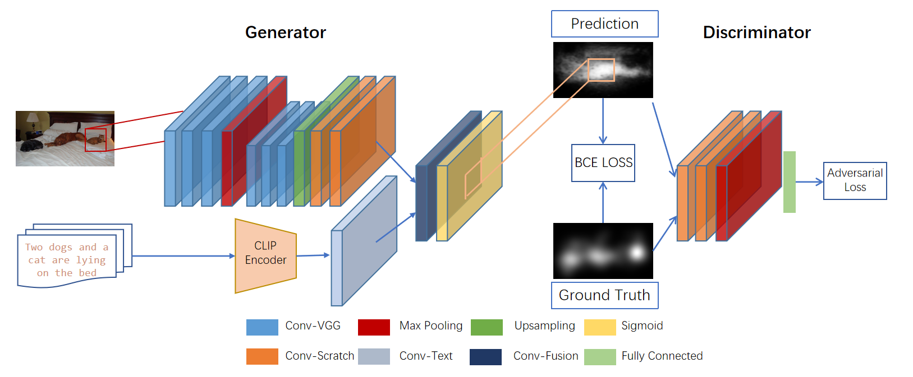
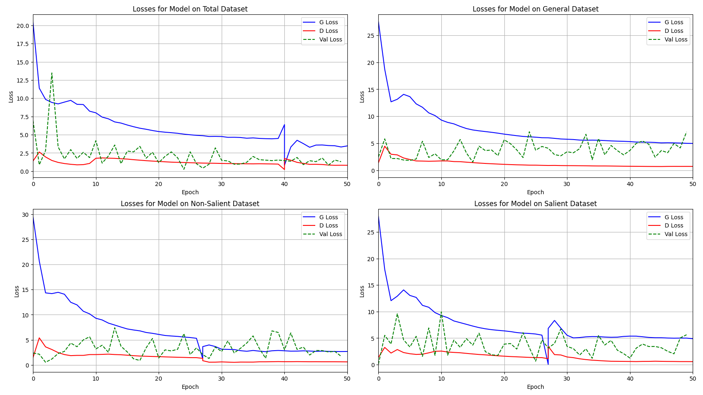

# CLIP-SalGan: A Text-Guided Saliency Model Combining GAN and CLIP Metrics

## Model Architecture


## Performance Display
+ ### Outputs

<div align="center">
    
    
    
</div>


+ ### Training Loss

  

## Installation
```
conda install --yes -c pytorch pytorch=1.7.1 torchvision cudatoolkit=11.0
pip install ftfy regex tqdm
pip install git+https://github.com/openai/CLIP.git
pip install PIL
pip install matplotlib
```
## Quickly Start
+ Firstly execute ```https://github.com/gumusserv/CLIP-SalGan.git``` to clone the repo;
+ Then execute ```cd CLIP-SalGan```;
+ Finish relavant packege installation;
+ Write the image with its text description in the code(```apply_model.py```), for example:
```
image_paths = ['saliency/image_1800/000000026503_0.png']
text_options = {
    "sal": "Two dogs and a cat are lying on the bed",
    "nonsal": "There are white lamps on the bedside table",
    "general": "Three animals are lying on the bed, next to the white lamp"
}
```
+ Execute ```python apply_model.py --help``` to check relevant information;
+ Execute ```python apply_model.py --model [model] --text [text_type]``` to predict the saliency map.

## Directory Structure
+ ```features```: Result and visualization;
+ ```model```: Four types of models:```total, sal, nonsal, general``` respectively;
+ ```saliency```: Dataset ```SJTU-TIS```;
+ ```TestAndPlot```: Test my model's performance and plot pictures;
+ ```apply_model.py```: Apply the model;
+ ```Data_Utils.py```: Split the data, create dataloader and generate dataset used for my saliency model;
+ ```discriminator.py```: Design for my discriminator;
+ ```generator.py```: Design for my generator;
+ ```get_data.py & get_data_part.py```: Get image data along with its text description;
+ ```get_image_text_Map.py```: Get mapping relationship between image and its text description of ```SJTU-TIS```;
+ ```SalGan_text.py```: Training main file, including the main process;
+ ```score.py```: Used to calculate metrics, ```AUC, sAUC, CC, NSS```;
+ ```text.json```: Record mapping relationship between image and text;
+ ```train.py```: Used to train the model.

## How to Train
+ In ```SalGan_text.py```, adjust the following code to fine tune the hyper parameters:
```
batch_size = 16
optimizer_G = torch.optim.Adam(generator.parameters(), lr=0.0002, betas=(0.5, 0.999))
optimizer_D = torch.optim.Adam(discriminator.parameters(), lr=0.0002, betas=(0.5, 0.999))
num_epochs = 50
```
+ Then run ```SalGan_text.py```, and the model will be trained and restored;
+ If you want more fine-grained control over the division of the training set, the validation set, and the test set, please refer to the comment  
 in ```Data_Utils.py``` and ```get_data_part.py```.
